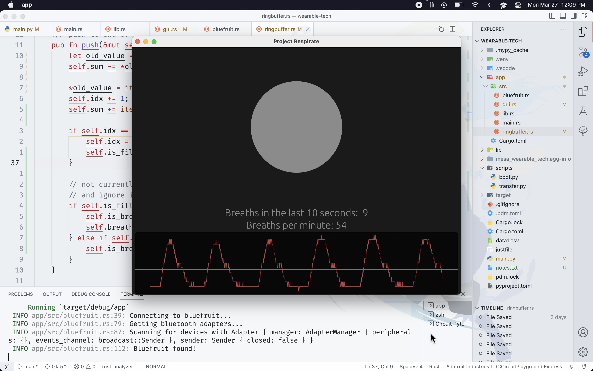

# Respiragator

A wearable device to monitor an infant's respiration. This is the code used for Long Reach High School's MESA 2023 submission.

# Images

The wearable device:

The companion app:

# Video Presentation

